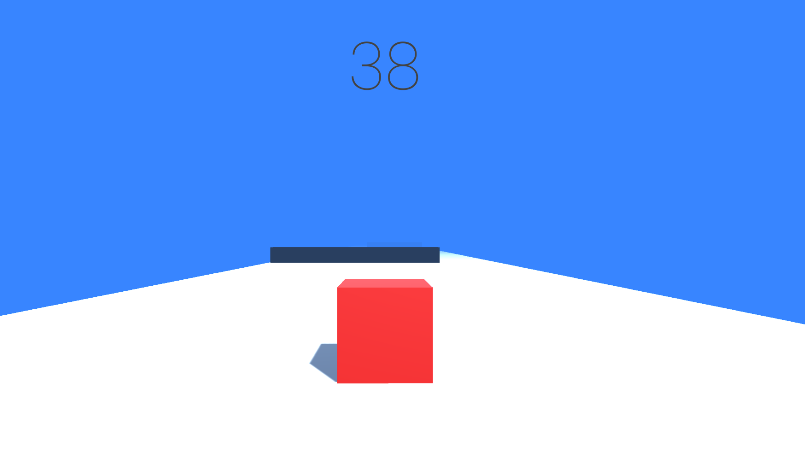

# 🎮 Cube Rush

## 🚀 Overview
Cube Rush is a fast-paced 3D Unity game where the player controls a cube navigating through a path filled with obstacles. The game focuses on timing, movement, and reflex-based gameplay mechanics.

---

## 🧠 Features
- 🎮 Smooth player movement  
- 🧱 Obstacle avoidance system  
- ⚡ Fast-paced gameplay  
- 🧭 Simple and clean level design  

---

## ▶️ Controls
- Move: Arrow Keys / WASD  
- Objective: Avoid obstacles and survive as long as possible  

---

## 📸 Gameplay

---

## 🛠️ Technologies Used
- Unity  
- C#  

---

## 💡 Future Improvements
- 🎯 Add scoring system  
- 🧠 Add levels and difficulty scaling  
- 🎵 Add sound effects and music  
- 🎨 Improve visuals and UI  

---

## 👨‍💻 Author
Hamza Muhammad Samy Aly Hassanein  
📧 hamzasamy54@gmail.com  
🔗 https://www.linkedin.com/in/hamza-samy-161a74356  
💻 https://github.com/hamzasamyy
